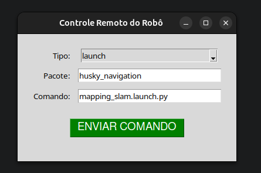
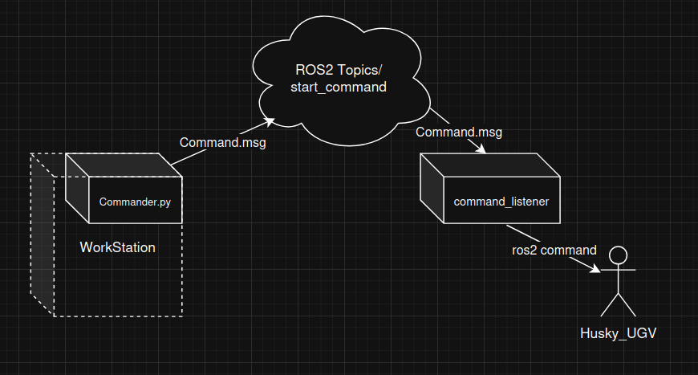

# Husky Commander

## 1. Descrição

`husky_commander` é um pacote ROS 2 (Jazzy) que fornece uma infraestrutura leve para controle remoto de um robô.

O objetivo principal deste pacote é permitir que um operador, a partir de uma aplicação gráfica (GUI) em um computador de "controle", envie comandos para o robô. Esses comandos são para executar ações de alto nível, como:

* `ros2 launch [pacote] [arquivo_launch.py]`
* `ros2 run [pacote] [executavel]`

Este pacote foi desenvolvido pensando em interações com pacotes de navegação complexos, como o [husky_navigation](https://github.com/husky/husky_navigation) (ou qualquer outro pacote que você tenha, como `meu_pacote_nav`), permitindo iniciar tarefas como mapeamento ou navegação sem precisar de acesso direto (SSH) ao terminal do robô.





## 2. Arquitetura

Este sistema é composto por três partes principais:

1.  **Este Pacote (`husky_commander`)**
    * `msg/Command.msg`: Define a mensagem customizada que contém o `tipo`, `pacote` e `comando`.
    * `scripts/waiter_node.py`: Um nó Python "ouvinte" (subscriber) que fica rodando no robô, esperando por mensagens no tópico `/start_command`.
    * `launch/command_listener.launch.py`: Um arquivo de launch simples que apenas inicia o `waiter_node.py`.

2.  **O Aplicativo de Controle (`gui_app.py`)**
    * Um script Python (Tkinter) independente que **não** faz parte deste pacote.
    * Ele fornece a interface gráfica para o operador inserir o comando.
    * Ele atua como um "publicador" (publisher), enviando a mensagem `Command.msg` para o tópico `/start_command`.

3.  **Pacotes do Robô (Ex: `husky_navigation`)**
    * Os pacotes-alvo que contêm os executáveis e launch files que desejamos disparar.

## 3. Instalação e Compilação

Assume-se que este pacote (`husky_commander`) e seus pacotes-alvo (como `husky_navigation`) estão localizados no mesmo workspace (ex: `~/clearpath_ws`).

1.  **Clone o pacote** (se aplicável) para `~/clearpath_ws/src/`.
2.  **Verifique as Dependências:** Certifique-se de que o `package.xml` e o `CMakeLists.txt` do `husky_commander` estão corretos (conforme os arquivos gerados anteriormente), incluindo as dependências de `rosidl_default_generators`, `rclpy` e `launch_ros`.
3.  **Compile o Workspace:**
    ```bash
    cd ~/clearpath_ws
    colcon build --packages-select husky_commander
    ```
4.  **Faça o Source:**
    ```bash
    source ~/clearpath_ws/install/setup.bash
    ```

## 4. Como Usar (Passo a Passo)

Este guia assume que você tem dois "dispositivos": o **Robô** (onde o `waiter_node` roda) e o **Controle** (onde a `gui_app` roda). Eles podem ser o mesmo computador, mas rodando em terminais diferentes.

### No Dispositivo do Robô (Lado do "Ouvinte")

Este é o processo para "armar" o robô, deixando-o pronto para receber comandos.

1.  Abra um terminal no robô (ou com acesso a ele via SSH).
2.  Faça o "source" do seu workspace:
    ```bash
    source ~/clearpath_ws/install/setup.bash
    ```
3.  Execute o launch file do `husky_commander`. Isso iniciará o `waiter_node.py`:
    ```bash
    ros2 launch husky_commander command_listener.launch.py
    ```
4.  Você verá uma mensagem de log confirmando que ele está funcionando:
    `[INFO] [command_waiter_node]: Nó "garçom" de comandos iniciado.`
    `[INFO] [command_waiter_node]: Esperando por comandos em /start_command...`

O robô agora está pronto e esperando.

### No Dispositivo de Controle (Lado da "GUI")

Este é o processo que o operador humano executa para enviar um comando.

1.  Salve o script `gui_app.py` em um local de fácil acesso (ex: `~/gui_app.py`).
2.  Abra um novo terminal.
3.  **IMPORTANTE:** Este terminal também precisa ter acesso ao ROS 2 e às definições da mensagem `husky_commander`. Faça o "source" do workspace (ou de uma instalação que contenha o `husky_commander`):
    ```bash
    source ~/clearpath_ws/install/setup.bash
    ```
4.  Execute o aplicativo da GUI:
    ```bash
    python3 ~/gui_app.py
    ```
5.  Uma janela da GUI aparecerá.

### Executando um Comando

1.  Com o **Terminal do Robô** e a **GUI de Controle** ambos em execução:
2.  Na GUI:
    * **Tipo:** `launch`
    * **Pacote:** `husky_navigation`
    * **Comando:** `mapping_slam.launch.py` (ou qualquer outro launch file que você queira)
3.  Clique no botão **"ENVIAR COMANDO"**.
4.  Observe o **Terminal do Robô**:
    * Você verá a mensagem de log: `[INFO] [command_waiter_node]: Comando recebido: launch husky_navigation mapping_slam.launch.py`
    * Imediatamente depois, o ROS 2 iniciará o processo de launch do seu pacote `husky_navigation`.